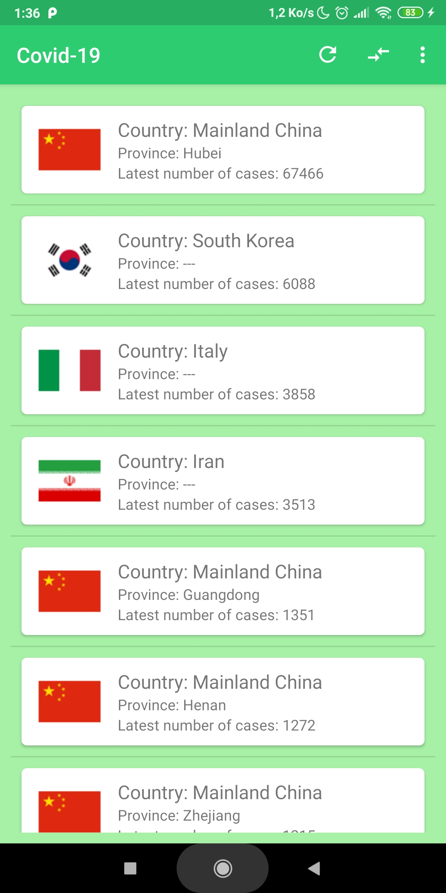
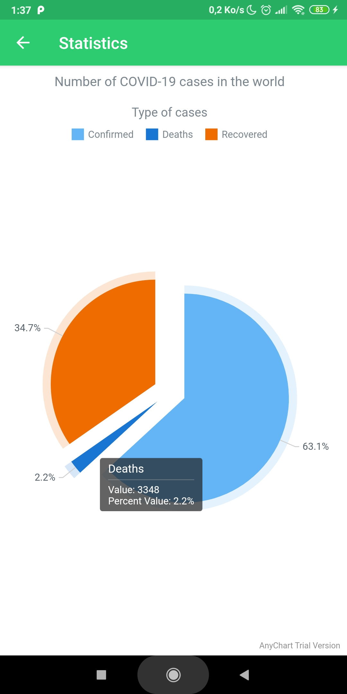
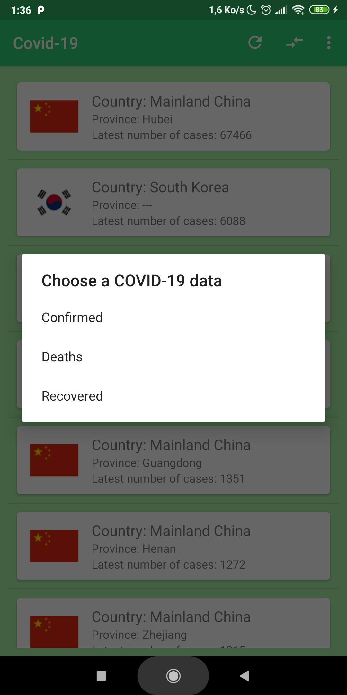

# coronavirus-tracker Android Realtime Application

> 🦠 This is an Android Java based application using my proper coronavirus-Heroku-tracker API (https://github.com/Omaroid/Covid-19-API). 🦠

## Data

📋 The data comes from the [2019 Novel Coronavirus (nCoV) Data Repository, provided
by JHU CCSE](https://github.com/CSSEGISandData/2019-nCoV). It is
programmatically retrieved, re-formatted and stored in the server for one hour. 📋

I've also programmed a skeduler on Heroku to run the refresh script every day since the data there is updated daily.

## Prerequisites

You will need the following things properly run it on your computer.

* [Android Studio](https://developer.android.com/studio#downloads)

## License

The application is available to the public strictly for informational, educational and academic purposes.

## Screenshots

  
